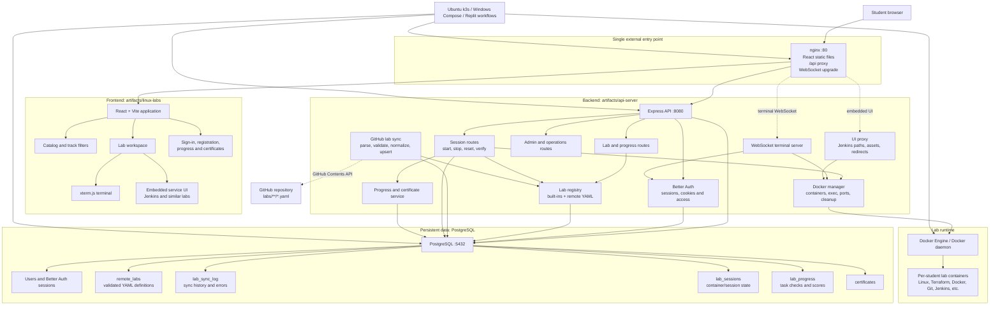
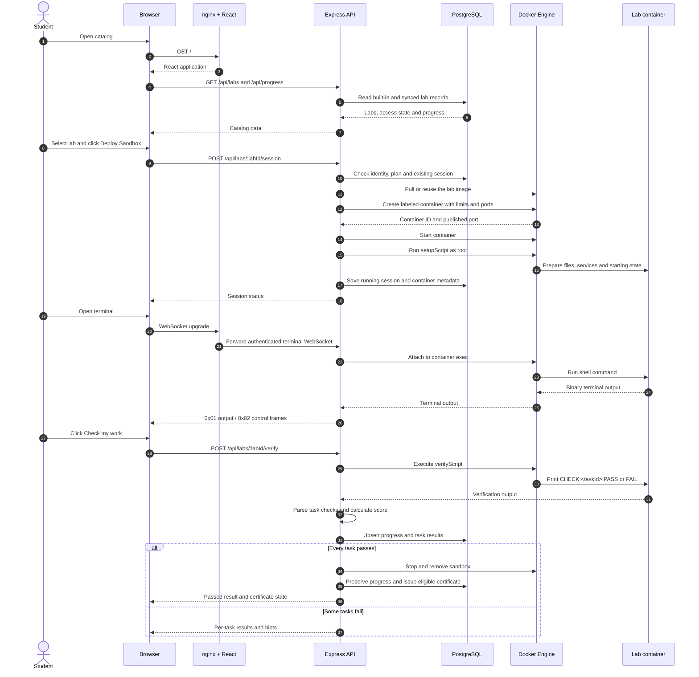
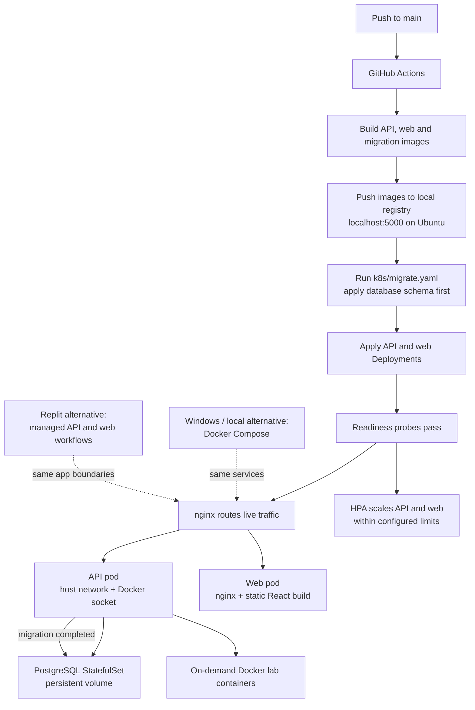

<div align="center">

# 🖥️ Linux Lab Master

**A self-hosted, hands-on DevOps lab platform — spin up real sandboxes and learn by doing.**

[](#-lab-tracks)
[](#-lab-tracks)
[](#-installation)

</div>

---

## What Is This?

Linux Lab Master is a self-hosted web application that provides **browser-based terminal sandboxes** for practising real DevOps skills. Every lab drops you into a live Docker container with a pre-configured environment — no cloud account, no local tool installs, no setup friction.

- **Write real commands** in a real shell — not multiple choice questions
- **Automatic verification** checks your work and tells you exactly what passed or failed
- **Progressive curriculum** — Foundation → Intermediate → Advanced within each track
- **Shareable certificates** — complete a track to earn a certificate with a public verification link
- **Self-hosted** — runs entirely on your own machine or server, air-gapped friendly

---

## 🗂 Lab Tracks

| Track | Levels | Labs | What you'll learn |
|-------|--------|------|-------------------|
| **Linux** | L1 · L2 · L3 | 29 | Filesystem, processes, networking, permissions, scripting, system administration |
| **Terraform** | L1 · L2 · L3 | 30 | Infrastructure as Code — variables, modules, state, workspaces, lifecycle rules |
| **Jenkins** | L1 | 2 | CI/CD fundamentals — server setup and GUI-based jobs |
| **Docker** | L1 | 11 | Images, containers, exec/logs, Dockerfiles, volumes — all taught via a realistic in-sandbox simulator |
| **Git** | L1 | 10 | Init, commits, branching, remotes, stash & reset |
| **Kubernetes** | L1 | 2 | Pods and manifests — practise Kubernetes concepts with kubectl |
| **Ansible** | L1 | 1 | Introductory configuration and automation |

> The catalog currently contains 85 labs: 74 YAML definitions fetched from this
> repository plus 11 built-in Linux labs. Click **Fetch Labs** inside the app at
> any time to pull the latest YAML content without restarting.

---

## 🚀 Installation

### Prerequisites (both platforms)

- **Docker** — the app and every lab sandbox run inside Docker containers
- **4 GB RAM** minimum (8 GB recommended)
- **10 GB free disk space** (Docker images + build cache)
- Internet connection during installation (images are pulled once; after that the app is fully offline)

---

### 🐧 Linux — Ubuntu (Recommended)

Supported: **Ubuntu 20.04 LTS**, **22.04 LTS**, **24.04 LTS**

**1. Clone the repository**

```bash
git clone https://github.com/Shivam-yd/Linux-Lab-Master.git
cd Linux-Lab-Master
```

**2. Run the installer**

```bash
sudo bash installer/install.sh
```

The installer will:
1. Install Docker Engine and k3s (single-node Kubernetes)
2. Start a local image registry on `localhost:5000`
3. Copy the project to `/opt/linuxlabs`
4. Ask interactively for your URL, admin email, and optional GitHub token
5. Build Docker images and push them to the local registry (~3–5 minutes on first run)
6. Pre-pull all lab sandbox images so labs start instantly
7. Create the initial verified database backup, install the daily backup schedule, and deploy everything to k3s

**3. Open the app**

```
http://localhost:8085 or http://ServerIP:8085
```

**4. All future deploys are automatic** — push to `main` → GitHub Actions builds new images, runs the migration Job, and updates the workloads. No manual steps needed.

#### How deploys work

Pushing to `main` triggers GitHub Actions, which:

1. Builds new Docker images for the API, web frontend, and migration runner
2. Pushes them to the local registry (`localhost:5000`) on your VPS
3. Applies the migration Job (`k8s/migrate.yaml`) — schema changes run before the new pods come up
4. Applies the API and web Deployment manifests with the new image tag

Kubernetes updates the workloads after the migration succeeds:
- A new pod starts and passes its readiness probe
- The web Deployment uses a rolling update.
- The API Deployment uses `Recreate` because it uses host networking and must not have two pods competing for port 8080.

The installer (`install.sh`) only ever runs once — it is not re-invoked on code pushes.

#### Pod structure

| Component | Kind | Min pods | Max pods | Notes |
|-----------|------|----------|----------|-------|
| `api` | Deployment + HPA | **1** | **5** | Scales on CPU ≥ 70 % or memory ≥ 80 %. Uses host networking and mounts the host Docker socket. |
| `web` | Deployment + HPA | **1** | **3** | nginx static build. Scales on CPU ≥ 70 %. |
| `postgres` | StatefulSet | **1** | **1** | Never scaled — 10 Gi persistent volume. |
| `migrate` | Job | — | — | Runs once per deploy; retries up to 3× on failure. |

Steady-state pod count: **3** (one each). Under load the HPA adds pods up to the max, then scales back down after a 5-minute stabilisation window (one pod at a time) to avoid flapping.

#### Resource requests and limits

| Container | CPU request | CPU limit | Memory request | Memory limit |
|-----------|-------------|-----------|----------------|--------------|
| `api` | 250 m | 1 000 m (1 core) | 256 Mi | 1 Gi |
| `web` | 100 m | 500 m | 64 Mi | 256 Mi |

HPA uses the *request* values as the 100 % baseline when computing utilisation percentages. k3s ships with `metrics-server` enabled by default, so no extra setup is needed.

#### Rolling update strategy (api and web)

```
maxUnavailable: 0   ← old pod stays up until new one is ready
maxSurge:       1   ← one extra pod is created during the transition
```

Readiness probes gate the cutover:
- **api** — `GET /api/stats` on port 8080 (checks every 5 s, up to 60 s)
- **web** — `GET /` on port 80 (checks every 5 s)

#### Managing the deployment

```bash
kubectl get pods -n devlabmaster                         # check pod status
kubectl logs -n devlabmaster deploy/api                  # api logs
kubectl logs -n devlabmaster deploy/web                  # web logs
kubectl rollout status deployment/api -n devlabmaster    # watch a rollout
kubectl rollout undo deployment/api -n devlabmaster      # rollback api
kubectl rollout undo deployment/web -n devlabmaster      # rollback web
```

#### Files and config

| Path | Purpose |
|------|---------|
| `/opt/linuxlabs` | Application files |
| `/opt/linuxlabs/.env` | Secrets (auto-generated, do not edit manually) |
| `k8s/` | Kubernetes manifests |

#### Certificates and sharing

When all labs in a track are complete, open `/certificate/<track>` to view the
certificate. The **Share** button opens the device share dialog when supported;
otherwise it copies a public verification link to the clipboard. Anyone with
the link can verify the certificate at `/verify/<certificate-id>` without
signing in.

---

### 🪟 Windows — Windows 10 / Windows Server 2019+

> **Note:** The Windows installer is built with [Inno Setup](https://jrsoftware.org/isinfo.php). A pre-compiled `.exe` is provided in [Releases](../../releases).

#### End-user installation (pre-compiled installer)

**Prerequisites:**
- Windows 10 (build 17763+) or Windows Server 2019+
- [Docker Desktop for Windows](https://www.docker.com/products/docker-desktop/) installed and running
- Virtualisation enabled in BIOS/UEFI (required by Docker Desktop)

**Steps:**

1. Install **Docker Desktop** and ensure it is running (whale icon in system tray)
2. Download `LinuxLabs-Setup.exe` from [Releases](../../releases)
3. Right-click → **Run as administrator**
4. Follow the wizard — the installer will:
   - Copy all project files to `C:\Program Files\LinuxLabs\`
   - Generate secrets and write `C:\Program Files\LinuxLabs\.env`
   - Build Docker images (~3–5 minutes)
   - Pre-pull all lab sandbox images
   - Register a **Windows service** (`LinuxLabs`) set to start automatically
   - Create a desktop shortcut that opens the app in your browser
5. When the wizard finishes, open **http://localhost:8085** in your browser

The Windows installer defaults to local-only access. For LAN access, update
`C:\Program Files\LinuxLabs\.env` with the server URL in `BETTER_AUTH_URL` and
`TRUSTED_ORIGINS`, then restart the `LinuxLabs` service. See
[`installer/README.md`](installer/README.md) for the exact settings.

#### Managing the Windows service

```powershell
# From an elevated PowerShell or Command Prompt:
net start  LinuxLabs        # start
net stop   LinuxLabs        # stop
sc query   LinuxLabs        # check status

# Or via Services panel:
# Win+R → services.msc → find "Linux Labs" → Start / Stop / Restart
```

#### Logs (Windows)

```
C:\Program Files\LinuxLabs\LinuxLabs.out.log
C:\Program Files\LinuxLabs\LinuxLabs.err.log
```

#### Building the installer from source

| Tool | Where to get it |
|------|----------------|
| [Inno Setup 6](https://jrsoftware.org/isinfo.php) | Free, ~5 MB |
| [WinSW v3](https://github.com/winsw/winsw/releases) | Download `WinSW-x64.exe`, rename to `WinSW.exe`, place in `installer\` |

```
1. Install Inno Setup 6
2. Place WinSW.exe in the installer\ folder
3. Open installer\setup.iss in the Inno Setup IDE
4. Press Ctrl+F9 to compile
5. Installer is written to installer\Output\LinuxLabs-Setup.exe
```

---

### ☁️ Replit

The imported project is configured as a pnpm workspace with managed API and web
workflows. Replit supplies PostgreSQL through the `postgresql-16` module and
injects `DATABASE_URL`; add `SESSION_SECRET` as a Replit Secret before starting.

```bash
bash scripts/setup-replit.sh
```

The setup script installs the frozen lockfile dependencies, checks PostgreSQL,
and pushes the Drizzle schema. It is safe to run again. The web preview runs at
the root path and proxies `/api` to the API workflow. `BETTER_AUTH_URL` must
match the current Replit development domain; update the shared variable if the
domain changes.

Live terminal sandboxes work when the Replit runtime exposes the Docker daemon.
If Docker is unavailable, lab browsing, authentication, and progress tracking
remain available but sandbox deployment is unavailable. The API warms the lab
images at startup and reports a normal lab-start error for any image that could
not be pulled.

Certificates and their public verification links work the same way on Replit.
If direct clipboard access is blocked in an embedded preview, the Share button
uses a compatibility fallback.

---

## 🔄 Fetching New Labs

Labs are stored as YAML files in this repository under `labs/`. When new labs are pushed, open the app and click **Fetch Labs** in the top-right corner — it pulls the latest YAML files and syncs them into the database instantly, no restart required.

The app also polls for new labs automatically every hour.

---

## 🗄 Architecture

The diagrams below use Mermaid, which GitHub renders natively.

### System structure



### Student lab workflow



### Lab-definition sync workflow

```mermaid
flowchart LR
    commit["Author pushes<br/>labs/**/*.yaml to GitHub"]
    trigger["Background poll<br/>every hour<br/>or Fetch Labs button"]
    contents["GitHub Contents API<br/>recursive directory listing"]
    download["Download YAML files"]
    parse["Parse YAML"]
    validate{"Zod schema<br/>validation succeeds?"}
    normalize["Normalize trusted metadata<br/>Jenkins ports, UI path and service mode"]
    upsert["Upsert remote_labs by lab id<br/>only update changed SHA"]
    logok["Write successful lab_sync_log entry"]
    reject["Reject definition<br/>record validation error"]
    logerr["Write failed lab_sync_log entry"]
    registry["Async lab registry merges<br/>built-in labs + remote labs"]
    catalog["Catalog refreshes<br/>new lab appears without restart"]

    commit --> trigger
    trigger --> contents
    contents --> download
    download --> parse
    parse --> validate
    validate -->|yes| normalize
    normalize --> upsert
    upsert --> logok
    logok --> registry
    validate -->|no| reject
    reject --> logerr
    registry --> catalog
```



### Deployment and runtime workflow



On the Ubuntu installation, the application components run as Kubernetes
workloads managed by single-node k3s. Lab sandboxes are additional Docker
containers spawned on demand by the API. On Windows, Docker Compose runs the
same PostgreSQL, migration, API, and nginx web services. In Replit, the API
and web are managed workflows, while lab deployment depends on whether the
runtime exposes a Docker daemon.

---

## 📁 Repository Structure

```
.
├── labs/
│   ├── linux/          ← Linux track YAML lab definitions
│   ├── terraform/      ← Terraform track YAML lab definitions
│   └── jenkins/        ← Jenkins track YAML lab definitions
├── artifacts/
│   ├── api-server/     ← Node.js/Express backend
│   └── linux-labs/     ← React frontend
├── installer/
│   ├── install.sh      ← Ubuntu one-shot installer (k3s + first deploy)
│   ├── setup.iss       ← Inno Setup script (Windows installer source)
│   └── nginx.conf      ← nginx config bundled into the web Docker image
└── k8s/
    ├── postgres.yaml   ← Namespace + PostgreSQL StatefulSet
    ├── app.yaml        ← API and web Deployments + Services
    └── migrate.yaml    ← DB migration Job (applied each deploy)
```

---

## 🤝 Contributing Labs

Labs are plain YAML files — no code changes needed to add new content.

1. Fork this repository
2. Create a new `.yaml` file under `labs/<track>/`
3. Follow the lab schema (see any existing lab for reference — key fields: `id`, `track`, `level`, `category`, `difficulty`, `order`, `instructions`, `setupScript`, `verifyScript`)
4. Ensure `## Steps` is a heading in `instructions` — everything under it is hidden behind the *Reveal Step-by-Step Guide* button
5. Test your `verifyScript` locally with `docker run --rm --init ubuntu:24.04 bash -lc '...'`
6. Open a pull request

---

## 📄 License

MIT
